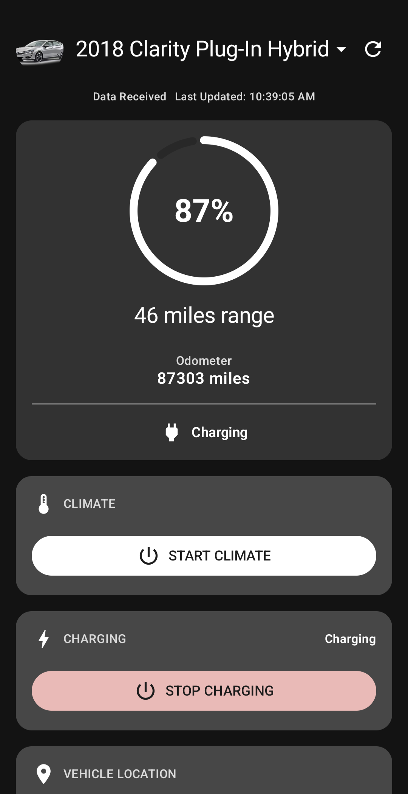

# Logue

Logue is a mobile-first companion application for Honda and Acura EV owners. It provides real-time dashboard data and offers a streamlined, native Android alternative to official apps.

<p align="center">
  
  
</p>

## Credits & Inspiration
This project stands on the shoulders of giants:
- **[honstar-mqtt](https://github.com/tsightler/honstar-mqtt)**: A critical resource for understanding the Honda/Acura API and MQTT integration via AWS IoT Core.
- **[Relink](https://get-relink.app/)**: An iOS app by reddit user **ThierryBuc** that served as as inspiration for this project.


## Features (varies by model)

### Real-Time Dashboard
- **Battery & Range**: Instant visibility into State of Charge (SoC) and remaining EV range.
- **Charging Status**: Detailed information on plug status, and charge completion ETA.
- **Tire Pressures**: Real-time PSI/kPa monitoring for all four tires.
- **Odometer**: Current vehicle mileage tracking.

### Remote Controls
- **Climate Control**: Start/stop climate control and view current status.
- **Vehicle Security**: Remote lock and unlock functionality.
- **Lights & Horn**: Trigger vehicle lights and horn remotely.
- **Secure PIN Access**: Remote commands are protected by your vehicle's PIN.

## Tech Stack
- **Framework**: Native Android (Kotlin & Jetpack Compose)
- **Communication**: MQTT (AWS IoT Core) for real-time updates
- **Backend API**: Integration with Honda/Acura Identity and Web Services
- **Dependency Injection**: Hilt

## Installation & Setup

### Option 1: Install the Android APK (Recommended)
The easiest way to get Logue on your device is to download the latest release:
1.  Navigate to the **[Releases](https://github.com/jimdogx/logue-app-kotlin/releases)** page of this repository.
2.  Download the `.apk` file to your Android device.
3.  Open the file and follow the prompts to install. 
    *Note: You may need to enable "Install from unknown sources" in your device settings.*

### Option 2: Building from Source (Advanced)
If you prefer to run the app in development mode or build your own APK:

#### Prerequisites
- Android Studio
- An Android device or emulator

#### Setup
1. **Clone the repository**:
   ```bash
   git clone https://github.com/mcspencehouse/logue-app-kotlin.git
   cd logue-app-kotlin
   ```

2. **Open in Android Studio**:
    Open the cloned project in Android Studio.

3. **Run the app**:
    Build and run the app on your device or emulator.

## Security & Privacy

**Logue is designed with a "Privacy First" architecture:**

- **Zero External Tracking**: This application does not send your data, login credentials, or vehicle information to any third-party infrastructure. All communication is directly between the app and the official Honda/Acura API.
- **Local Credential Storage**: Your HondaLink credentials and vehicle PIN are stored exclusively on your device. We use Android's `EncryptedSharedPreferences` for storage.
- **Encryption**: Sensitive data (passwords, PINs) are encrypted at rest using **AES256-GCM**. 

## Development Note

This project was developed using a "vibe coding" approach—leveraging advanced AI pair programming to rapidly iterate and implement complex vehicle integration logic. While AI-assisted, the focus remains on technical reliability and a clean user experience.

## License

This project is licensed under the MIT License.

---
*Disclaimer: This app is not affiliated with American Honda Motor Co., Inc. Use remote commands responsibly.*
